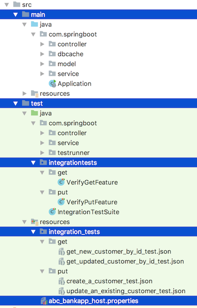

# spring-boot-integration-test
Zerocode based integration-tests for a spring-boot application.
> Keep it simple and easy while doing the integration tests



### Where are the integration tests?
+ The JUnit integration tests are located under-
  + test/java/integrationtests/get
  + test/java/integrationtests/put

You can run and debug them individually.
  
### Where is the Suite to run all the tests?
The suite JUnit suite test located-
+ `src/test/java/integrationtests/IntegrationTestSuite.java`

### Where are the unit tests cases?
The JUnit unit tests are located **as usual** in their respective package, under root of-
+ `src/test/java/com/springboot` i.e. under package `com.springboot`

### How do they both run in the maven life cycle?
e.g.
> mvn clean install

+ The unit tests run as usual in the `test` phase
+ Then the integration-tests are fired in the `<goal>integration-test</goal>` as configured in the `pom.xml`

```     
  <plugin>
      <groupId>org.apache.maven.plugins</groupId>
      <artifactId>maven-failsafe-plugin</artifactId>
      <executions>
          <execution>
              <goals>
                  <goal>integration-test</goal>
                  <goal>verify</goal>
              </goals>
              <configuration>
                  <includes>
                      <include>integrationtests.IntegrationTestSuite.java</include>
                  </includes>
              </configuration>
          </execution>
      </executions>
  </plugin>
```     

+ Please look at the the Suite-Test class `<include>integrationtests.IntegrationTestSuite.java</include>` which is pointing 
to the root of the tests in the test-resources folder `resource/integration_tests`

i.e. as below-
```
@TargetEnv("abc_bankapp_host.properties")
@TestPackageRoot("integration_tests")  //You can point this to any package you need -or- use Junit Suite runner to point to individual test classes
@RunWith(E2eJunitSuiteRunner.class)
public class IntegrationTestSuite {

}
```

### What does the above @RunWith do?
> @RunWith(E2eJunitSuiteRunner.class)

Ans: It starts the spring applications and then fires the tests once by one.
See below how it brings up the application.
```
public class E2eJunitSuiteRunner extends ZeroCodePackageRunner {

    static{
        Application.start();
    }

    public E2eJunitSuiteRunner(Class<?> klass) throws InitializationError {
        super(klass);
    }
}
```
